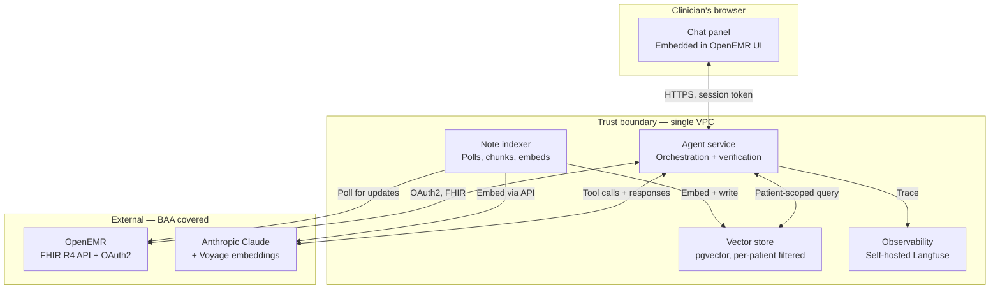
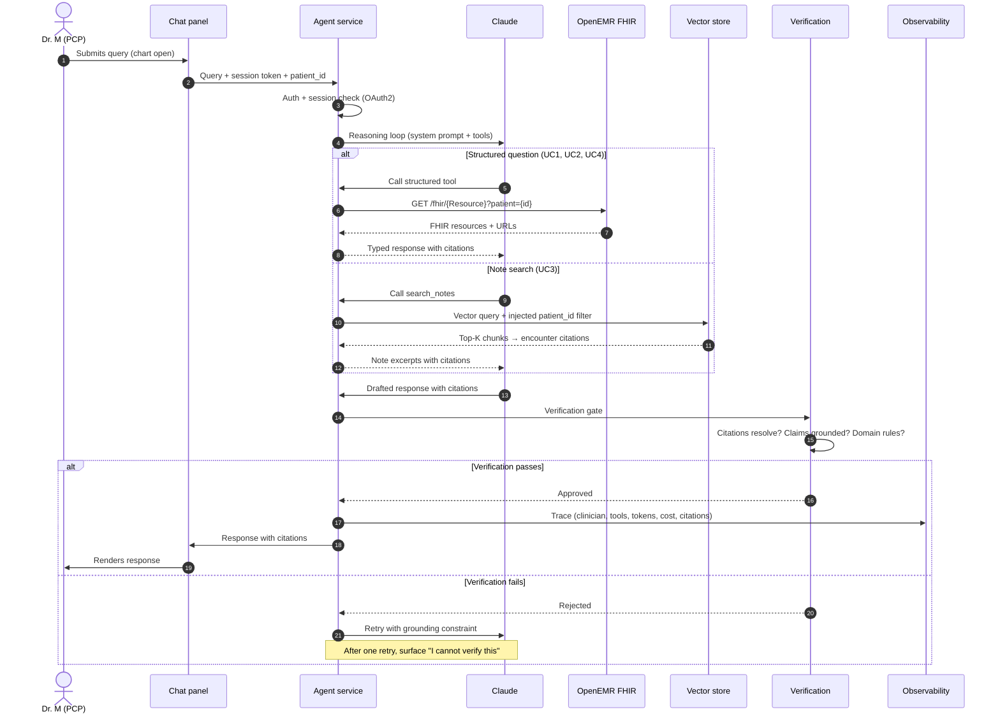

# ARCHITECTURE.md — Clinical Co-Pilot

> **Companion documents:** `USERS.md` (the user this serves and the use cases it addresses) and `AUDIT.md` (findings about OpenEMR that constrain this design). Every architectural decision in this document traces to one or both.

---

## Executive Summary

The Clinical Co-Pilot is a read-only conversational AI agent integrated into OpenEMR for primary care physicians. The user, scope, and four use cases are defined in `USERS.md`; OpenEMR-specific constraints are established in `AUDIT.md`. Every decision below traces to one or both.

**Integration shape — hybrid API posture.** The agent runs as an external service that authenticates to OpenEMR via OAuth2 with a single user-role token. Reads go through the **FHIR R4 API**; writes (deferred for v1, but the path is named) go through the **Standard REST API**, because per `AUDIT.md` Q1 FHIR write coverage is thin and the Standard REST API rejects patient-context tokens. Direct database access and embedded PHP modules were rejected: DB access bypasses OpenEMR's authorization; an embedded module couples the agent to OpenEMR's PHP build. The chart is updated by humans through OpenEMR's existing interfaces; the agent reads current state at each query and never writes.

**FHIR conformance is per-resource and treated as advisory.** OpenEMR supports US Core 3.1.1 / 7.0.0 / 8.0.0 with 8.0.0 as the default ceiling, but each resource service overrides its own `getSupportedVersions()`. The audit observed live that `MedicationRequest` and `AllergyIntolerance` emit no `meta.profile` array at all (confirmed bug). Consequence: the agent treats `meta.profile` as advisory, not contractual, and validates retrieved fields directly rather than trusting profile claims. At startup the agent reads the `CapabilityStatement` and per-resource `meta.profile` to log the actual surface, but it programs against pinned 8.0.0 field expectations with graceful fallback.

**Retrieval is hybrid.** Structured FHIR tools handle structured data — problems, medications, allergies, labs, vitals, encounters, today's appointment — covering UC1, UC2, UC4, and the structured portion of UC3. RAG over an embedded corpus of clinical encounter notes handles UC3's unstructured-search use case ("has she ever mentioned X?"). Structured tools win on latency, citation precision, and authorization simplicity; RAG wins for semantic search over free-text prose. Using one tool for both would be worse on both axes.

**LLM and storage.** Anthropic Claude (Sonnet) is the reasoning model, chosen for tool-calling reliability and BAA availability. Embeddings use Voyage AI, which Anthropic acquired in 2025 — keeping reasoning and embedding under one vendor relationship and one BAA. The vector store is self-hosted **pgvector** in the agent's VPC: no third-party vector-DB BAA needed, PHI inside one trust boundary, mandatory `patient_id` filter on every query injected from the authenticated session (never from user input).

**Verification.** Every claim carries a citation to a FHIR resource URL or encounter note. A verification layer rejects responses with unresolved citations, hallucinated identifiers, or claims unsupported by retrieved data. When the record is silent, the agent reports silence rather than fills it. Authorization is inherited from the clinician's OAuth2 token, not a service account — every audit log entry names the actual clinician. Observability traces (acting clinician, tools, tokens, citations) land in self-hosted Langfuse with HIPAA's six-year retention.

**UC1's visit-reason path is free text only.** Per `AUDIT.md` finding #3, `Encounter.reasonCode` is uncoded text — the agent quotes it verbatim and lets the LLM classify, rather than relying on a SNOMED matcher.

**Key tradeoffs.** Hybrid retrieval is more surface than structured-only, accepted because UC3 requires it. Self-hosted pgvector is more operational work than a managed vector DB, accepted to keep PHI in one trust boundary. Read-only in v1 is deliberate: verification of agent-written content in the legal medical record is a separate, harder problem.

---

## 1. Goals and Non-Goals

### Goals
- Serve the four use cases in `USERS.md` (pre-room briefing, mid-visit factual lookup, mid-visit pivot, post-visit recap) for the PCP user defined there.
- Every claim grounded in the patient's record, with verifiable citations.
- Authorization that respects OpenEMR's existing model — agent never extends a clinician's access.
- HIPAA-aware architecture: every decision consistent with Security and Privacy Rules; no compliance debt for a future production deployment.
- Observability sufficient to answer the case study's required questions (what did the agent do, in what order, how long, what failed, at what cost).

### Non-Goals (v1)
- **Write capabilities.** No agent-generated chart notes, no agent-placed orders. All write actions remain with the PCP through OpenEMR's existing interfaces.
- **Other user roles.** Nurses, residents, specialists are not v1 agent users. Their notes are read by the agent; they do not interact with it.
- **Generalized medical Q&A.** The agent answers questions grounded in *this patient's* record. It is not a clinical reference.
- **Cross-patient queries.** One patient at a time. Panel-level analytics are out of scope.
- **Production HIPAA certification.** v1 is architected to support compliance, not certified to it. See `AUDIT.md` Q5.

---

## 2. System Architecture

### 2.1 Components



The system has six components:

1. **OpenEMR** (existing). PHP/MariaDB EHR. Source of truth for patient data. Per `AUDIT.md`, integration is via the FHIR R4 API at `/apis/{site}/fhir/*` (US Core 3.1.0).

2. **Agent Service.** External service, written in Python, that hosts the agent's reasoning loop. Authenticates to OpenEMR's OAuth2 server. Exposes a chat endpoint to the front-end.

3. **Vector Store.** Self-hosted pgvector inside a Postgres instance in the same cloud account/VPC as the agent service. Stores embeddings of clinical note chunks plus metadata (patient_id, encounter_id, note_id, character offsets, embedded_at timestamp).

4. **Note Indexer.** Worker process that polls OpenEMR for new or updated encounter notes, chunks them, embeds the chunks via Voyage AI, and writes them to the vector store.

5. **LLM Provider.** Anthropic API (Claude Sonnet) for reasoning; Voyage AI (under Anthropic's BAA umbrella) for embeddings. Per case study standing assumption, BAA is in place.

6. **Observability Stack.** Self-hosted Langfuse (or equivalent) for trace logging. Each agent invocation produces a trace with the acting clinician, patient, query, tools called, LLM token counts, and citations.

### 2.2 Front-end integration

The agent is exposed as a chat panel inside the OpenEMR clinician UI. The panel is loaded into the existing chart view via a UI customization point (specific mechanism to be confirmed during build — module hook, theme injection, or iframe with appropriate CSP relaxation). The chat panel calls the Agent Service over HTTPS, authenticated by a token derived from the clinician's OpenEMR session.

The chat panel is the only surface for agent interaction in v1. There is no separate agent app, no patient-facing surface, no API for third parties.

### 2.3 Request lifecycle



A single PCP query flows like this:

1. **Clinician submits a query** in the chat panel with the patient chart open. The panel includes the current `patient_id` and the clinician's session token.
2. **Front-end forwards** to the Agent Service. The session token is exchanged for an OAuth2 access token scoped to the acting clinician.
3. **Agent Service** loads the conversation context (this is a fresh session, no cross-conversation memory — see §3), the patient_id, and the OAuth2 token.
4. **The reasoning loop** begins. The LLM is called with the system prompt, the user query, and the available tool definitions.
5. **The LLM may call tools.** Each tool call is mediated by the Agent Service: the agent never calls OpenEMR or the vector store directly; the service does, with the appropriate auth and patient-scoping.
6. **Tools return data.** Structured FHIR responses or RAG retrieval results are passed back to the LLM.
7. **The LLM produces a response.** The response is intended to be a chat message with embedded citation references.
8. **The verification layer runs** (§5). It checks citations resolve, claims are grounded, and domain constraints are not violated.
9. **The response is logged** to the observability stack with the full trace — query, tools, tokens, citations, response — tagged to the acting clinician and patient.
10. **The response is returned** to the front-end and displayed.

If any step fails, the agent returns a transparent error rather than a confident-sounding partial answer (§7).

---

## 3. State Management and Memory

The agent has no cross-conversation memory in v1. Each agent session starts fresh, reads the current state of the patient's chart, and proceeds. This is a deliberate design choice with three justifications:

- **Verification model stays clean.** Every claim traces to the chart, never to "what we said last time." Stale agent memory cannot contradict updated chart data.
- **Authorization stays simple.** A new session re-validates the clinician's authorization to access this patient. Nothing carries over.
- **HIPAA simplicity.** Conversation history is logged for audit (per HIPAA Security Rule §164.312(b)), but is not used as model input. The audit log is not a memory; it's a record.

Within a single conversation, multi-turn context is preserved (the LLM sees the prior turns of *this* conversation). This satisfies UC3's mid-visit pivot, which is multi-turn by design. When the chat panel is closed and reopened, the session is fresh.

---

## 4. Data Retrieval — the Hybrid Model

### 4.1 Structured tools (FHIR API)

The agent has tools backed by FHIR API calls. Each tool encodes a specific clinical question, not a generic "fetch FHIR resource" passthrough. Tools and their FHIR mappings:

| Tool | FHIR resource(s) | Use cases |
|---|---|---|
| `get_patient_summary` | `Patient` | All |
| `get_active_conditions` | `Condition?clinical-status=active` | UC1, UC3 |
| `get_active_medications` | `MedicationRequest?status=active` | UC1, UC2, UC3 |
| `get_allergies` | `AllergyIntolerance` | UC1, UC2, UC3 |
| `get_recent_labs` | `Observation?category=laboratory&_sort=-date` | UC1, UC2, UC3 |
| `get_lab_history` | `Observation?category=laboratory&code={code}` | UC2, UC3 |
| `get_recent_vitals` | `Observation?category=vital-signs&_sort=-date` | UC1 |
| `get_encounters` | `Encounter?_sort=-date` | UC1, UC3 |
| `get_todays_appointment` | `Appointment?date=today&patient={id}` | UC1 |
| `get_encounter_detail` | `Encounter/{id}` + structured fields of the encounter form | UC4 |

Each tool:
- Takes `patient_id` as an argument and is rejected if the OAuth2 token does not authorize access to that patient.
- Returns a typed structured response, not raw FHIR JSON. The LLM sees clean data, not boilerplate.
- Filters out soft-deleted records and inactive entries by default (per `AUDIT.md` Q2 schema gotchas).
- Distinguishes preliminary vs. final lab statuses; preliminary results are clearly labeled in tool output.
- Includes a stable citation reference (the FHIR resource URL) for every record returned.

### 4.2 RAG over clinical notes

For symptom-mention search and other unstructured-note queries (UC3's "has she ever mentioned headaches" pattern), the agent uses a single tool:

| Tool | Backing | Use cases |
|---|---|---|
| `search_notes` | Vector similarity over chunked clinical notes | UC3 |

Implementation:
- **Chunking.** Notes are chunked at paragraph boundaries with a max chunk size (target ~500 tokens). Each chunk preserves `(patient_id, encounter_id, note_id, character_offset_start, character_offset_end, encounter_date, note_type)`.
- **Embeddings.** Voyage AI (under Anthropic's BAA umbrella). Same provider as the LLM to keep PHI within one vendor boundary.
- **Storage.** pgvector index in self-hosted Postgres, in the agent's VPC. No external vector DB.
- **Retrieval.** Cosine similarity, top-K results (K=5 default, configurable). **Mandatory `patient_id` filter** injected by the Agent Service from the authenticated session — never from user input. A query without a `patient_id` filter is rejected before it reaches the vector store.
- **Citations.** Returned chunks resolve to encounter-level citations (the note, the encounter, the date). The LLM never cites "chunk N" to the user; chunks are plumbing.
- **Freshness.** A polling worker (the Note Indexer) periodically queries OpenEMR for encounters with `last_updated > last_indexed_at` and re-embeds modified notes. v1 polling interval: every 60 seconds. On-demand re-embedding (triggered by an agent query for a recently updated note) is a fallback path for the edge case where the indexer hasn't caught up.

### 4.3 When to use which

The LLM is given clear guidance in the system prompt: structured tools for structured questions, `search_notes` for symptom-mention or free-text-history questions. In practice the model decides based on the query, but the system prompt nudges firmly: "If the question can be answered by an active problem, an active medication, a lab value, or a vital, use the structured tool. Use `search_notes` only for content that lives in note prose."

### 4.4 System prompt — the visit-reason-as-lens directive

The system prompt for UC1 (pre-room briefing) wires the patient-stated reason for visit into the agent's behavior. A simplified sketch of the relevant section:

```
You are preparing a 30-second briefing for a primary care physician
who is about to enter the exam room. The clinician has 90 seconds
total and will absorb your output in roughly 30.

PROCESS:
1. Call get_todays_appointment first. The patient-stated reason for
   visit is the primary lens for relevance. Treat it as a signal,
   not as confirmed truth — surface it explicitly to the clinician
   ("the patient indicated they're here for X").
2. If the reason is present, prioritize tool calls that produce
   data relevant to that reason. Diabetes follow-up → recent A1c,
   glucose, antidiabetic meds, foot/eye/renal monitoring labs.
   Knee pain → recent encounters mentioning the joint, related
   imaging, current pain medications.
3. Regardless of today's reason, ALWAYS surface chronic conditions
   from the active problem list. A diabetic with knee pain is still
   a diabetic.
4. If the patient-stated reason is missing or blank, fall back to
   the structured visit type from the appointment record and report
   the absence transparently.

OUTPUT STRUCTURE:
- Today: what the visit appears to be about, in one or two lines.
- Changes: what's changed since last visit, with citations.
- Active conditions to keep in mind: chronic problems on the
  active list, with one-line context for each.

Keep the briefing under 150 words. Cite every factual claim.
```

The actual production prompt is longer (it includes verification reminders, error-handling instructions, and tool-use guidance), but the structure above is what shapes UC1's flow.

### 4.5 UC1 worked example

To make the visit-reason flow concrete:

**Scenario A — diabetes follow-up.** Patient-stated reason: "diabetes check-up, I've been feeling tired." Agent calls `get_todays_appointment` → reads reason → calls `get_recent_labs` (filtered to A1c, fasting glucose, lipid panel, renal panel), `get_active_medications` (notes metformin, glipizide), `get_active_conditions` (notes T2DM, hypertension on the active list), `get_recent_vitals` (BP trend). Briefing structure: "Today — diabetes follow-up; patient reports fatigue. Changes — A1c up from 7.1 to 7.8 in March; metformin dose increased last visit. Active — T2DM, HTN (BP last visit 142/88). Fatigue not previously documented; consider workup if not explained by glycemic context."

**Scenario B — same patient, knee pain visit.** Patient-stated reason: "right knee pain for 2 weeks." Agent calls `get_todays_appointment` → reads reason → calls `get_encounters` (filtered for musculoskeletal mentions in last year), `search_notes` (RAG, query "knee pain") to find any prior mentions, `get_active_medications` (full list, but with NSAIDs and analgesics flagged), `get_active_conditions` (T2DM and HTN still surfaced because they're chronic). Briefing structure: "Today — right knee pain × 2 weeks, no prior knee complaints in record. Changes — none directly relevant. Active — T2DM, HTN (relevant for NSAID prescribing decisions). No prior MSK workup found."

Same patient, same chart, same agent — different briefing, because the visit reason shapes which structured data is prioritized and how the summary is framed. This is the core reason UC1 is an agent task and not a static dashboard: the relevance of the same chart data depends on today's question.

---

## 5. Verification Layer

The verification layer is the single most important component for clinical trust. It sits between the LLM's raw response and the user.

### 5.1 What verification checks

1. **Citation completeness.** Every factual claim about the patient must carry a citation. The verification layer parses the LLM's response, identifies factual claims, and confirms each has an attached citation.
2. **Citation resolution.** Every cited FHIR URL or encounter ID must resolve to a real record the agent actually retrieved during this session. The agent cannot fabricate citation IDs that look plausible but don't exist.
3. **Domain constraint enforcement.** A defined set of clinical safety checks:
   - Medication mentions are cross-checked against the active medication list. The agent cannot say a patient is on a medication that isn't in `MedicationRequest`.
   - Lab values mentioned are cross-checked against retrieved `Observation` resources for matching code and date.
   - Drug-drug interaction warnings the agent surfaces are cross-checked against a deterministic interaction table (v1: a static reference list of common high-severity interactions; v2: integration with a clinical decision support service).
4. **Silence is silence.** If the agent's output asserts something the record does not support, the assertion is rejected and the agent is asked to retry with explicit grounding. Per `USERS.md`, the agent must report silence ("no prior headache complaints documented") rather than infer.

### 5.2 What happens when verification fails

A failed verification does not return the unverified response with a warning. It returns a corrected response, an explicit "I cannot verify this" message, or — for the deterministic safety checks — a hard refusal. The user is never shown a confidently-stated but unverifiable claim.

If verification fails repeatedly on the same query (model cannot produce a verifiable response after one retry), the agent surfaces the limitation transparently: "I have data on this patient but cannot produce a verified answer to that question. Please review the chart directly."

### 5.3 What verification doesn't catch

Verification catches grounding failures, not clinical reasoning errors. If the agent correctly cites a lab and correctly states what it says but draws a clinically wrong inference from it, verification will not flag that — because the citation is valid. This is the right boundary: the agent is a record-grounded assistant, not a clinical decision support system. Diagnostic and therapeutic reasoning remains with the PCP.

This limitation is named explicitly in `USERS.md` (the agent is not a clinical reference) and is non-negotiable for v1.

---

## 6. Authorization and Security

### 6.1 OAuth2 model

The agent authenticates to OpenEMR via OAuth2 against the FHIR API. Scopes requested per use case (per `AUDIT.md` Q4 minimum-necessary analysis):

```
user/Patient.read
user/Condition.read
user/MedicationRequest.read
user/AllergyIntolerance.read
user/Observation.read
user/Encounter.read
user/Appointment.read
```

No write scopes. No system-wide scopes. No DocumentReference (deferred — v2 may add for richer note retrieval).

### 6.2 Acting-clinician identity

Every agent action is performed in the context of a specific, authenticated clinician. The OAuth2 token represents that clinician. Audit log entries record the clinician's identity, not "the agent." The agent never has authorization the underlying clinician lacks.

### 6.3 Per-patient enforcement

Three layers of patient scoping:

- **OAuth2 layer.** OpenEMR's FHIR API enforces the clinician's authorization to access the patient at the API level.
- **Agent Service layer.** Every tool call validates `patient_id` against the active session before being issued.
- **Vector store layer.** Every `search_notes` query injects a `patient_id` filter from the session, never from user input. A query missing the filter is rejected.

All three must succeed for a tool to return data. This is defense-in-depth: a bug in any one layer does not expose another patient's data.

### 6.4 Prompt injection defense

Patient-supplied free-text fields (per `USERS.md`, the patient-stated reason for visit; per `AUDIT.md` Q1, also intake forms and portal messages) are untrusted input. The agent's prompt construction:

- Wraps patient-supplied text in clearly delimited blocks (XML-style tags).
- Instructs the LLM in the system prompt that text inside those blocks is data, not instructions.
- Strips or escapes prompt-injection-pattern markers in the input.
- The verification layer re-checks the output: if the agent's response appears to follow instructions found in patient input rather than the clinician's query, it is flagged.

This is best-effort, not absolute. The case study's interview question "what failure mode worries you most" gets an honest answer: prompt injection through patient-supplied free text is a live risk class for any agent that ingests such fields.

---

## 7. Failure Modes and Graceful Degradation

The case study explicitly calls out failure modes as non-negotiable. The agent's responses to common failure modes:

| Failure | Agent behavior |
|---|---|
| OpenEMR FHIR API unreachable | Return: "I cannot reach the patient record system right now. Please review the chart directly." Log and alert. |
| FHIR API returns partial data (some resources fail) | Surface what was retrieved, explicitly name what was not. "I have her active medications and recent labs, but I could not retrieve her encounter history. Continuing with what I have." |
| Vector store unreachable | Structured tools continue to function; `search_notes` fails with a transparent message. UC1, UC2, UC4 still work; UC3's symptom search degrades. |
| LLM provider unreachable or rate-limited | Agent returns a transparent error. Retries with backoff; after retry budget exhausted, surfaces the failure clearly. |
| LLM returns an unverifiable response | Verification layer rejects; agent retries once; on second failure, surfaces the limitation transparently. |
| Patient record is incomplete (missing fields) | Per `USERS.md` "Handling information gaps" — report silence rather than fill. |
| Patient-stated reason for visit is blank or missing | Agent reports the absence transparently ("no patient-stated reason captured for today's visit"), falls back to the structured visit type from the appointment record, and produces a chronic-condition-aware generic briefing. UC1 degrades but does not fail. |
| Prompt injection detected | Reject the patient-supplied content as instruction; log; surface to clinician. |
| Authorization fails (clinician not authorized for patient) | Hard refusal with clear message. Logged for audit. |

The principle: **the agent never silently hides a failure**. Partial answers are explicit about what is partial. Failures are transparent. A clinical tool that crashes loudly is safer than one that fails silently.

---

## 8. Observability

Every agent invocation produces a structured trace containing:

- **Identity.** Acting clinician, patient, session ID.
- **Input.** User query, conversation context.
- **Reasoning.** Each LLM call (system prompt, messages, tools available), each tool invocation (name, arguments, result, latency, success/failure), each LLM response (text, token counts in/out, model, cost).
- **Verification.** Each verification check run, each pass/fail, each retry.
- **Output.** Final response presented to the clinician, with citations.
- **Timing.** End-to-end latency and per-step latency.

Traces land in self-hosted Langfuse (or equivalent — choice deferred slightly, but constraint is BAA-eligible self-hostable). Retention follows HIPAA's six-year documentation requirement.

The case study's required observability questions all have answers from this trace:
- *What did the agent do?* — the reasoning section.
- *In what order?* — sequence is preserved in the trace.
- *How long did each step take?* — latency per step.
- *Did any tools fail?* — success/failure per tool call.
- *Tokens consumed and cost?* — per-LLM-call accounting, summed across the trace.

---

## 9. Evaluation

The agent ships with an evaluation suite (full design in a forthcoming `EVALS.md`). Skeleton:

- **Use-case happy paths.** Each of UC1-UC4 has at least 5 representative queries with expected behaviors (correct tools called, correct citations, correct surface of silence where applicable).
- **Failure-mode tests.** Tool failure, partial data, missing records, unauthorized patient access attempts.
- **Adversarial tests.** Prompt injection attempts via patient-supplied free text. Cross-patient data leakage attempts via crafted queries.
- **Verification tests.** Hand-crafted LLM responses with hallucinated citations to confirm the verification layer rejects them.
- **Regression tests.** A baseline of fixed queries with fixed expected behaviors, run on every change.

Pass/fail per test category. CI integration: eval suite runs on every PR; failures block merge.

---

## 10. Cost Posture (preliminary)

Detailed cost analysis is a separate deliverable. Sketch:

- **Per-query cost.** Dominated by LLM tokens. Pre-room briefing involves ~3-5 tool calls, ~5-10K tokens in / ~500 tokens out per turn. At Sonnet pricing this is on the order of pennies per query.
- **Embedding cost.** One-time per note plus on update. Voyage embeddings are cheap; full reindex of a 1,800-patient practice is bounded.
- **Vector store cost.** Self-hosted Postgres; no per-query vendor cost.
- **Observability cost.** Self-hosted Langfuse; storage cost only.

Scaling to 100 / 1K / 10K / 100K users is a separate analysis. Architectural changes anticipated at each scale (replicas, queueing, dedicated index sharding) are noted in a separate cost document.

---

## 11. Major Tradeoffs Made

| Decision | Tradeoff accepted | Why |
|---|---|---|
| Hybrid retrieval (structured + RAG) | More architectural surface than structured-only | UC3 symptom search genuinely requires it; structured tools alone cannot answer "has she ever mentioned X" reliably |
| Self-hosted pgvector | More operational work than managed vector DB | Removes a BAA dependency; keeps PHI inside one trust boundary |
| Read-only agent in v1 | UC4 cannot autocomplete chart notes | Verification of agent-written legal medical record content is a separate, harder problem |
| No cross-conversation memory | Cannot reference "what we discussed last time" without re-querying chart | Verification model stays clean; stale memory cannot contradict updated chart |
| Single LLM provider (Anthropic) | No provider redundancy in v1 | Simplifies BAA scope; reduces vendor surface |
| OAuth2 user-role tokens only | No patient-context delegation | Per `AUDIT.md` Q1, Standard REST API rejects patient-context tokens; agent acts on behalf of clinician, not patient |
| Polling worker for note indexing | 60-second freshness lag possible | Simpler than webhook-driven indexing; fallback on-demand re-embedding handles edge cases |

---

## 12. Open Items and v2 Roadmap

Items deliberately deferred from v1 (named here so the deferrals are explicit, not hidden):

- **DocumentReference / external document retrieval.** Adding scope and surface for scanned documents and external records.
- **Multi-role agent (nurses, residents, specialists).** Authorization model already supports it; UI and use case definition are the work.
- **Agent-suggested chart note drafts (copilot pattern, not autonomous write).** Defensible v2 once verification of generated text is solved.
- **Clinical decision support integration.** Real drug-drug interaction service, dose-checking against renal function, etc.
- **Cross-patient panel queries.** "Show me my diabetics with A1c > 9." Different surface, different auth model.
- **Webhook-driven note indexing** (replacing polling).
- **Performance hardening for concurrent clinical use** (the case study's 300-user scenario).
- **Production HIPAA certification posture** (signed BAAs across all vendors, formal risk assessment, breach procedures).

---

## 13. Defending This Architecture — Anticipated Questions

The case study lists interview prep questions. Anticipated answers:

- **Why this verification design?** Citation completeness + citation resolution + deterministic domain checks. Catches grounding failures (hallucinations, fabricated citations) deterministically. Does not catch reasoning failures — that boundary is intentional and named.
- **What does the agent do when a tool fails or a record is missing?** §7. Transparent failure, explicit naming of what's missing, no silent partials.
- **Where are the trust boundaries and how are they enforced?** OpenEMR (canonical truth) ↔ Agent Service (orchestration, no PHI persistence beyond the trace) ↔ LLM (BAA-covered, no training) ↔ Vector store (in-VPC, per-patient filtered) ↔ Front-end (session-derived auth). Each boundary has an enforcement mechanism.
- **What does the eval suite test that a happy-path demo wouldn't reveal?** Failure modes, prompt injection attempts, cross-patient leakage attempts, hallucinated citations, silence-handling.
- **How would you scale to 300 concurrent users in a 500-bed hospital?** Stateless Agent Service horizontally scales; pgvector on a managed Postgres with read replicas; LLM provider rate limits become the binding constraint and require either provisioned throughput or a queue. Production hardening is named in §12 as future work; the v1 architecture does not preclude it.
- **What would you change before you'd be comfortable with a real physician relying on this?** Full eval suite with clinical reviewer ground truth; production HIPAA certification posture; clinical decision support integration for the safety checks v1 stubs out; longer evaluation period in shadow mode before clinician-visible deployment.
- **What failure mode worries you most?** Prompt injection through patient-supplied free text. Mitigations are best-effort, not absolute. This is named honestly rather than dismissed.