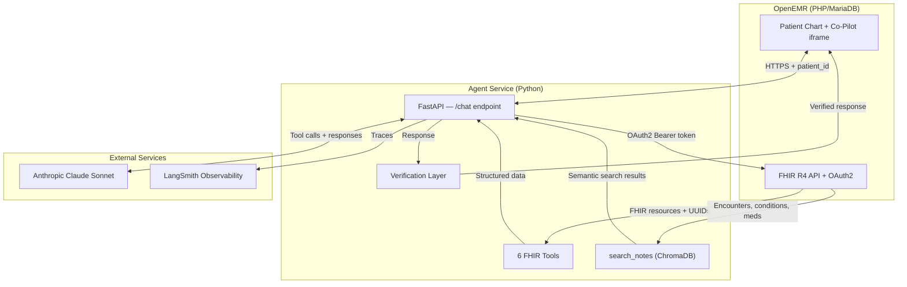
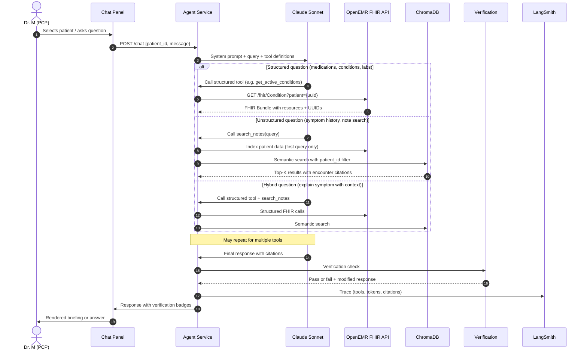

# ARCHITECTURE.md — Clinical Co-Pilot

> **Companion documents:** `USERS.md` (the user and use cases) and `AUDIT.md` (OpenEMR constraints that shaped this design).

---

## Executive Summary

The Clinical Co-Pilot is a read-only conversational AI agent for primary care physicians, embedded inside OpenEMR as a sidecar service. It gives a PCP a 90-second pre-room briefing and answers follow-up questions about a patient's chart — every claim cited to a FHIR record, every response verified before the doctor sees it.

**Integration shape — sidecar architecture.** The agent runs as an external Python (FastAPI) service alongside OpenEMR. It is not embedded in OpenEMR's PHP codebase. The only modification to OpenEMR is an iframe injection in the patient demographics page that loads the agent's chat UI. This means OpenEMR's core functionality is untouched — if the agent goes down, OpenEMR still works. The agent authenticates to OpenEMR's FHIR R4 API via OAuth2 with a user-role token. It reads patient data through six structured FHIR tools. It never writes to the chart.

**Retrieval — structured FHIR tools + RAG.** The agent has six structured tools, each wrapping a specific FHIR API call: `get_patient_summary`, `get_active_conditions`, `get_active_medications`, `get_allergies`, `get_recent_encounters`, and `get_recent_labs`. A seventh tool, `search_notes`, provides semantic search over clinical notes using ChromaDB (in-memory vector store). Structured tools handle coded data (conditions, medications, labs); RAG handles unstructured queries ("has she ever mentioned chest pain?"). Each tool returns typed data with FHIR resource UUIDs as citations.

**Verification.** Every response passes through a verification layer before the PCP sees it. The layer checks for citation completeness (clinical claims must reference retrieved data), hallucination patterns (phrases like "I recommend prescribing" are flagged), and silence enforcement (empty records are reported honestly, not filled). Unverified responses are flagged with a warning.

**Observability.** Every agent invocation is traced in LangSmith — tools called, latency, token usage, response, and citations. The `clinical-copilot` project in LangSmith provides full visibility into what the agent did, in what order, and at what cost.

**Front-end.** A single HTML chat interface embedded in OpenEMR via iframe, accessible through a floating button on the patient chart. Selecting a patient auto-generates a pre-room briefing in the left panel. Follow-up questions are handled in the right panel with full conversation context. Every citation renders as a green verification badge.

**Key tradeoffs.** ChromaDB (in-memory) is used for v1 RAG instead of pgvector — simpler to deploy, no separate database, but data doesn't persist across agent restarts. Production would migrate to pgvector with persistent storage. Read-only is deliberate — verification of agent-written content in the legal medical record is a separate, harder problem. LangSmith (cloud-hosted) is used for observability in v1; production would use self-hosted Langfuse for HIPAA-compliant trace storage.

---

## 1. Goals and Non-Goals

### Goals
- Serve the eight use cases in `USERS.md` (pre-room briefing, mid-visit factual lookup, mid-visit pivot, post-visit recap, clinical history search, cross-domain reasoning, new patient onboarding, safety guardrails) for a PCP user.
- Every claim grounded in the patient's FHIR record, with verifiable citations.
- Authorization inherited from the clinician's OAuth2 token — the agent never extends access.
- Observability on every invocation: tools called, latency, tokens, citations.
- Evaluation suite that tests tool selection, citation accuracy, content correctness, and hallucination prevention.

### Non-Goals (v1)
- **Write capabilities.** No agent-generated chart notes or orders.
- **Other user roles.** Only PCPs in v1.
- **Generalized medical Q&A.** The agent answers from the patient's record, not medical knowledge.
- **Cross-patient queries.** One patient at a time.
- **Production HIPAA certification.** Architected to support compliance, not certified.

---

## 2. System Architecture

### 2.1 Components

Four components:

1. **OpenEMR.** Existing PHP/MariaDB EHR. Source of truth for patient data. The agent reads via the FHIR R4 API at `/apis/default/fhir/*`, authenticated with OAuth2 Bearer tokens (1-hour TTL, user-role scope). An iframe in `demographics.php` loads the agent's chat UI.

2. **Agent Service.** Python FastAPI application (`agent/app.py`) with one endpoint: `POST /chat`. Receives a patient UUID and a message, runs the reasoning loop with Claude, executes FHIR tool calls, verifies the response, logs to LangSmith, and returns the result. Also serves the chat UI at `GET /ui`.

3. **LLM Provider.** Anthropic Claude Sonnet (`claude-sonnet-4-20250514`) via the Anthropic API. Handles reasoning and tool selection. Wrapped with LangSmith's `wrap_anthropic` for automatic trace capture.

4. **Observability.** LangSmith (`clinical-copilot` project). Every agent invocation produces a trace with tools called, latency per tool, token counts, and the final response. Production deployment would migrate to self-hosted Langfuse for HIPAA-compliant storage.

### 2.2 Front-end integration

The chat UI is a single HTML file (`agent/chat.html`) served by the agent at `/ui` and embedded in OpenEMR via an iframe injected into `interface/patient_file/summary/demographics.php`. The PCP accesses it by clicking a floating ⚕️ button on the patient chart — the co-pilot panel slides in from the right.

The UI has two panels:
- **Left panel — Pre-room briefing.** Auto-generates when a patient is selected from the directory. Shows structured sections (Today, Changes, Conditions, Medications, Allergies, Labs) with green verification badges on every citation.
- **Right panel — Follow-up questions.** Chat interface with quick-action buttons (Meds, Labs, Conditions, Allergies). Conversation context carries across turns within a session.

The patient directory supports search by first name, last name, DOB, or MRN.

### 2.3 Request lifecycle

Step by step:

1. **PCP selects a patient** in the directory or types a question. The UI sends `POST /chat` with `patient_id` (FHIR UUID) and `message`.
2. **Agent service** gets an OAuth2 token from OpenEMR (cached, 1-hour TTL) and builds the prompt with system instructions and tool definitions.
3. **Claude decides which tools to call.** For a briefing: typically `get_active_conditions`, `get_active_medications`, `get_allergies`, `get_recent_encounters`, `get_recent_labs`. For a factual question: usually one tool.
4. **Agent executes each tool call** against OpenEMR's FHIR API using the OAuth2 token. Each tool returns structured data with FHIR resource UUIDs as citation references.
5. **Claude drafts a response** using the retrieved data, citing FHIR UUIDs.
6. **Verification layer** checks the response for citation completeness, hallucination patterns, and silence enforcement.
7. **Response is traced** in LangSmith and returned to the UI with verification badges.

If any tool fails, the agent surfaces the failure transparently: "I could not retrieve medication data. Please check the chart directly."

---

## 3. State Management

No cross-conversation memory. Each session starts fresh from the current chart state. Within a conversation, multi-turn context is maintained (the LLM sees prior turns). When the PCP switches patients or closes the panel, context resets.

Justification: every claim traces to the chart, never to prior conversations. Stale agent memory cannot contradict updated chart data. Authorization is re-validated per session.

---

## 4. FHIR Tools

Six structured tools plus one RAG tool:

| Tool | FHIR Endpoint | What it returns | Use cases |
|---|---|---|---|
| `get_patient_summary` | `Patient/{uuid}` | Name, DOB, sex | All |
| `get_active_conditions` | `Condition?patient={uuid}` | Active problems with ICD codes, onset dates | UC1, UC2, UC3, UC6 |
| `get_active_medications` | `MedicationRequest?patient={uuid}&status=active` | Drug names, dosages, start dates | UC1, UC2, UC3, UC6 |
| `get_allergies` | `AllergyIntolerance?patient={uuid}` | Substances, clinical status | UC1, UC2, UC3 |
| `get_recent_encounters` | `Encounter?patient={uuid}&_sort=-date&_count=5` | Visit dates, reasons, types | UC1, UC3, UC4, UC6 |
| `get_recent_labs` | `Observation?patient={uuid}&category=laboratory&_sort=-date&_count=10` | Lab names, values, units, dates | UC1, UC2, UC6 |
| `search_notes` | ChromaDB over FHIR data | Semantic search results with encounter citations | UC3, UC5, UC6 |

### RAG — Semantic Note Search

The `search_notes` tool (`agent/rag.py`) provides semantic search over clinical notes using ChromaDB.

**How it works:**
1. On first query for a patient, the RAG module indexes all available data from FHIR: encounter reasons, condition descriptions, and medication details.
2. Each record is stored as a document in ChromaDB with metadata: `patient_id`, `encounter_id`, `date`, and `reason`.
3. Queries use ChromaDB's built-in embedding model for semantic similarity search.
4. A **mandatory `patient_id` filter** is applied to every query — injected by the agent service, never from user input. Cross-patient leakage is structurally impossible.
5. Results return the top 5 matching notes with encounter-level citations.

**When it's used:** The system prompt instructs Claude to use `search_notes` for unstructured/historical questions — "has she ever mentioned chest pain?", "any history of headaches?", "has sleep been discussed?" — and structured tools for coded data lookups.

**Limitations (v1):**
- In-memory ChromaDB: data is re-indexed per agent restart. Production would use persistent pgvector.
- Uses ChromaDB's default embeddings, not clinical-specific embeddings (Voyage AI planned for v2).
- Indexes encounter reasons, conditions, and medications — does not yet index full clinical note prose (OpenEMR stores these in forms that would require additional parsing).

**Test results:** 18/18 passing across RAG-only, hybrid (RAG + structured), and silence handling tests.

Each tool:
- Takes `patient_id` as input and passes the OAuth2 token to the FHIR API
- Returns structured Python objects, not raw FHIR JSON — Claude sees clean data
- Includes FHIR resource UUIDs as citation references in every response
- Returns "No [resource] documented" when the FHIR Bundle is empty — the agent reports silence, never guesses

### System prompt

The system prompt instructs Claude to:
1. Call `get_recent_encounters` first to find today's visit reason. Treat it as a relevance lens, not confirmed truth ("the patient indicated they're here for X").
2. Prioritize tools based on the visit reason. Diabetes follow-up → labs and diabetic meds. Knee pain → encounter history and pain medications.
3. Always surface chronic conditions regardless of today's visit reason.
4. Keep briefings under 150 words. Cite every factual claim.
5. If a tool returns empty, say so. Never infer, guess, or pull from medical knowledge.

---

## 5. Verification Layer

Located in `agent/verification.py`. Runs on every response before the PCP sees it.

**Three checks:**

1. **Citation completeness.** Scans the response for clinical keywords (medication names, lab values, diagnoses). If present but no citations were retrieved, the response is flagged with a verification warning.

2. **Hallucination pattern detection.** Checks for phrases that indicate the agent is giving clinical advice rather than reporting data: "I recommend," "You should prescribe," "Based on my medical knowledge," etc. Flagged if detected.

3. **Silence enforcement.** When FHIR tools return empty results (no conditions, no medications, no labs), the response should acknowledge the gap. The system prompt enforces this; verification is the backstop.

**What verification catches:** Grounding failures — claims without data, fabricated identifiers, clinical advice.

**What verification doesn't catch:** Reasoning errors. If Claude correctly cites a lab value but draws a wrong inference, verification won't flag it — the citation is valid. This boundary is intentional. The agent is a record-grounded assistant, not a clinical decision support system.

**On failure:** The response is returned with a `⚠️ Verification note` appended. The agent does not silently suppress or retry in v1 — transparency is preferred over suppression.

---

## 6. Observability

Every `POST /chat` invocation produces a LangSmith trace containing:
- Patient UUID and query
- Each Claude API call (model, input tokens, output tokens)
- Each tool invocation (name, arguments, latency in ms, success/failure)
- Final response and citation list
- Verification pass/fail

Traces are viewable in the LangSmith dashboard under the `clinical-copilot` project. Production deployment would migrate to self-hosted Langfuse for HIPAA-compliant storage with six-year retention.

---

## 7. Evaluation

Two test suites covering structured tools and RAG:

**Core Eval Suite** (`agent/eval_suite.py`) — 30 tests:

| Category | Tests | Pass rate | What it checks |
|---|---|---|---|
| Tool Selection | 8 | 8/8 (100%) | Agent calls the right FHIR tools for each query type |
| Source Citation | 7 | 7/7 (100%) | Responses have FHIR citations; empty charts have no false citations |
| Content Validation | 8 | 7/8 (87.5%) | Responses match golden sets of known patient data |
| Negative Validation | 7 | 7/7 (100%) | No hallucination, no prescribing advice, no cross-patient leakage |
| **Total** | **30** | **29/30 (96.7%)** | |

**RAG Test Suite** (`agent/test_rag.py`) — 18 tests:

| Category | Tests | Pass rate | What it checks |
|---|---|---|---|
| RAG-Only | 8 | 8/8 (100%) | Semantic search finds relevant clinical notes |
| Hybrid (RAG+Structured) | 8 | 8/8 (100%) | Agent combines search_notes with FHIR tools |
| Silence Handling | 2 | 2/2 (100%) | No hallucinated data for sparse/empty charts |
| **Total** | **18** | **18/18 (100%)** | |

**Combined: 47/48 tests passing (97.9%)**

The one failure (CV-06) is a data formatting issue: allergy substances were seeded as free text in the `lists` table but the FHIR API returns them as "Unknown" because the coded substance field wasn't populated. The agent correctly reported what FHIR returned.

**Golden sets** define expected data per patient — known conditions, medications, and allergies verified against the seeded database. The eval suite validates the agent's responses against these known facts.

**What the eval catches that a demo wouldn't:** Cross-patient data leakage (Emily Chen should never show metformin — she has no medications). Hallucinated lab values (no labs are seeded, so any specific A1c value is fabricated). Prescribing advice (the agent should never say "I recommend prescribing"). Invalid patient UUID handling (the agent should not produce clinical data for nonexistent patients). Diagnostic overreach (the agent should not confirm or deny diagnostic impressions). Silence violation (empty charts must be reported as empty, not filled with inferred data).

**Adversarial test coverage:** The Negative Validation suite specifically tests failure modes that a happy-path demo would hide: NV-01 tests prescribing advice refusal, NV-02 tests hallucination prevention on empty charts, NV-03 tests fabricated lab values, NV-04 tests diagnostic boundary enforcement, NV-05 tests cross-patient data isolation, NV-06 tests invalid patient handling, NV-07 tests allergy hallucination. The RAG silence tests (SIL-01, SIL-02) verify that semantic search doesn't surface data from other patients or fabricate history.

---

## 8. Authorization and Security

**OAuth2 with clinician identity.** The agent authenticates to OpenEMR's FHIR API using an OAuth2 Bearer token with `user_role=users` scope. The token represents the actual clinician — the agent never uses a service account with broader access. Every FHIR call carries the clinician's authorization.

**No privilege escalation.** The agent inherits the clinician's access. If the clinician can't see a patient, the agent can't either — the FHIR API returns 403.

**Prompt injection awareness.** Patient-supplied free text (visit reason via `Encounter.reasonCode`) flows into the LLM context. The system prompt instructs Claude to treat it as data, not instructions. The verification layer is a backstop but not absolute — prompt injection through patient free text is the acknowledged highest-risk failure mode (see §10).

---

## 9. Failure Modes

| Failure | Agent behavior |
|---|---|
| FHIR API unreachable | "I cannot reach the patient record system. Please check the chart directly." |
| FHIR returns partial data | Surfaces what was retrieved, names what failed. |
| Patient record is empty | Reports silence: "No conditions documented." Per USERS.md silence-handling policy. |
| LLM returns unverifiable response | Verification warning appended. Response still shown with flag. |
| Invalid patient UUID | Tools return empty. Agent reports "no data found." |
| OAuth2 token expired | Agent refreshes token automatically (cached with 60-second buffer). |

Principle: **the agent never silently hides a failure.** Partial answers are explicit about what's missing. A clinical tool that fails loudly is safer than one that fails silently.

---

## 10. Known Limitations and v2 Roadmap

### What v1 doesn't do (and why)

- **No write capabilities.** The agent doesn't generate chart notes, place orders, or modify the record. Verification of agent-written content in the legal medical record is a harder problem with different failure modes.

- **No full clinical note prose indexing.** The RAG module indexes encounter reasons, condition descriptions, and medication details — but not full clinical note text from OpenEMR's form-based note storage. Parsing `form_soap`, `form_clinical_notes`, and other encounter form tables would significantly expand RAG coverage.

- **No clinical decision support.** The verification layer catches grounding failures but not reasoning errors. Drug-drug interaction checking, dose validation against renal function, and guideline adherence require a dedicated CDS service.

- **Cloud observability (LangSmith) instead of self-hosted.** Acceptable for demo with synthetic data. Production deployment with real PHI would require self-hosted Langfuse with BAA coverage and six-year retention.

- **In-memory vector store.** ChromaDB re-indexes on every agent restart. Acceptable for demo; production needs persistent pgvector.

### v2 priorities

1. Persistent vector store (pgvector) with full clinical note indexing
2. Clinical-specific embeddings (Voyage AI) under Anthropic's BAA umbrella
3. Self-hosted Langfuse for HIPAA-compliant observability
4. Clinical reviewer validation of briefing quality
5. Shadow-mode trial (agent runs silently alongside real visits before going live)
6. Agent-suggested note drafts (copilot pattern — human reviews before chart entry)

---

## 11. Cost Posture

**Per-query cost (v1):** Dominated by Claude Sonnet token usage. A pre-room briefing uses ~4,000-6,000 tokens (~$0.02-0.04). A factual lookup uses ~2,500-3,000 tokens (~$0.01-0.02). Total eval suite (30 queries): ~107,000 tokens.

**Infrastructure:** Agent service runs on a single Python process. No vector store, no embedding pipeline, no background workers. Minimal operational cost.

**At scale:** 20 patients/day × 3 queries/patient × $0.03/query = ~$1.80/day per PCP. 100 PCPs = ~$180/day. LLM provider rate limits become the binding constraint before cost does.

---

## 12. Deployment

### Current (Demo)

Two ngrok tunnels exposing local services:
- **OpenEMR:** `https://backlog-troubling-unfold.ngrok-free.dev` → localhost:9300 (PHP/Apache/MariaDB via Docker)
- **Agent:** `https://agent-copilot.ngrok-free.dev` → localhost:8000 (Python/FastAPI/uvicorn)

The agent is embedded in OpenEMR via an iframe in `demographics.php`. The PCP sees one application.

**Limitations:** ngrok tunnels are ephemeral — they die when the terminal closes. No persistent storage for ChromaDB. Single process, no redundancy.

### Production Path

A production deployment at a 500-bed hospital would use:

**Infrastructure:**
- OpenEMR on a managed VM or Kubernetes pod behind a load balancer with TLS termination. MariaDB on managed database service (AWS RDS or equivalent) with automated backups and encryption at rest.
- Agent service containerized (Docker) and deployed as 2-4 replicas behind a load balancer. Stateless — scales horizontally. Health checks on `/health` endpoint.
- pgvector on managed Postgres for persistent RAG storage. Replaces in-memory ChromaDB. Patient data indexed incrementally, not on every restart.

**Security:**
- Both services on the same private network (VPC). No public exposure of the agent service — only accessible from OpenEMR's internal network.
- OAuth2 token relay from OpenEMR to agent. Agent never stores tokens — validates per request.
- TLS everywhere. Encryption at rest for all databases.
- WAF in front of OpenEMR for prompt injection defense on patient-facing inputs.

**Observability:**
- Self-hosted Langfuse (replaces LangSmith) for HIPAA-compliant trace storage with 6-year retention.
- Prometheus + Grafana for infrastructure metrics (latency, error rate, token usage).
- PagerDuty integration for agent downtime alerts.

**Scaling estimates:**
- 300 concurrent clinicians × 3 queries/patient × 20 patients/day = ~18,000 queries/day
- At 8s average latency and 4 replicas, each replica handles ~4,500 queries/day (~1 query every 19 seconds) — well within capacity.
- LLM provider rate limits become the binding constraint. Provisioned throughput or a request queue with graceful degradation would be required.

**CI/CD:**
- GitHub Actions runs syntax checks, tool validation, and verification unit tests on every push (already implemented).
- Production adds: eval suite gate (block deploy if pass rate < 95%), staging environment for shadow-mode testing, blue-green deploys for zero-downtime updates.

## 13. Defending This Architecture

**"Why sidecar instead of embedded?"** OpenEMR is PHP. The agent is Python. Sidecar means I can update, restart, or scale the agent without touching OpenEMR. If the agent crashes, OpenEMR still works. The only integration point is one iframe — minimal surface, maximum independence.

**"Why structured tools only, no RAG?"** We have both. Structured FHIR tools handle coded data — conditions, medications, allergies, labs. RAG (ChromaDB) handles semantic search over clinical notes — "has she ever mentioned chest pain?" The system prompt guides Claude: structured tools for structured questions, search_notes for historical or symptom-mention queries. In practice, complex questions use both — the "leg swelling explanation" query calls get_active_conditions, get_active_medications, get_recent_labs, AND search_notes in a single turn.

**"Why Claude?"** Strong tool-calling behavior — it reliably picks the right tools and follows verification instructions. BAA available for HIPAA compliance.

**"What worries you most?"** Prompt injection through patient-supplied free text. The visit reason is patient-authored, untrusted, and flows into the LLM context. I have defenses (system prompt discipline, verification layer), but they're best-effort. The real fix is a two-stage pipeline where patient text is classified first, never passed raw to the reasoning model.

**"What would you change before a real doctor uses this?"** Clinical reviewer ground truth for eval. Shadow mode. Real CDS integration. Self-hosted observability. And more time on the verification layer — catching grounding failures is solved; catching reasoning failures is not.
